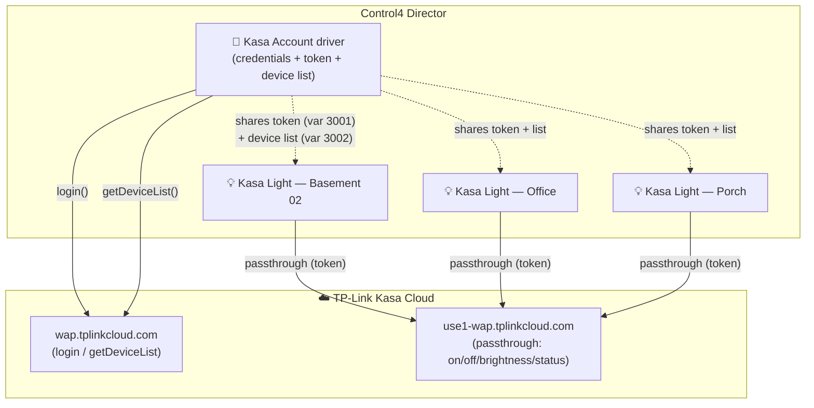
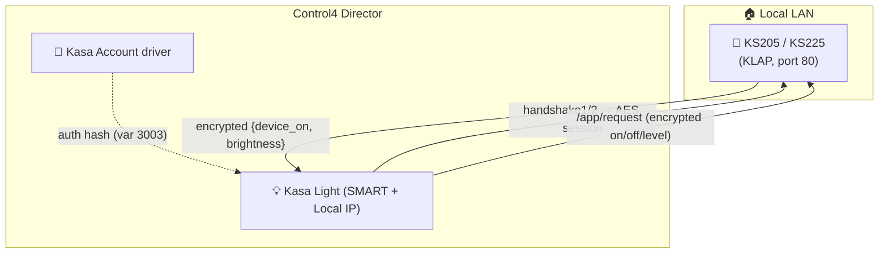
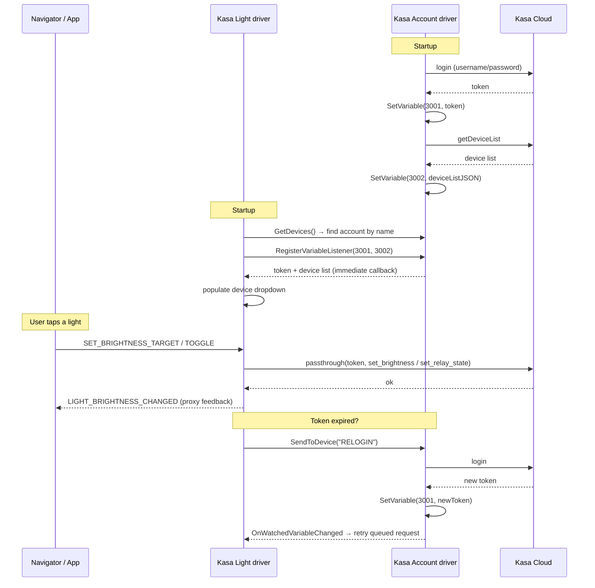
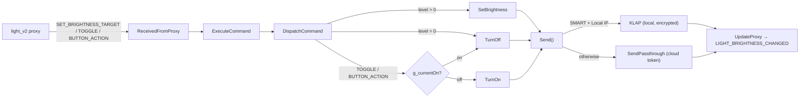
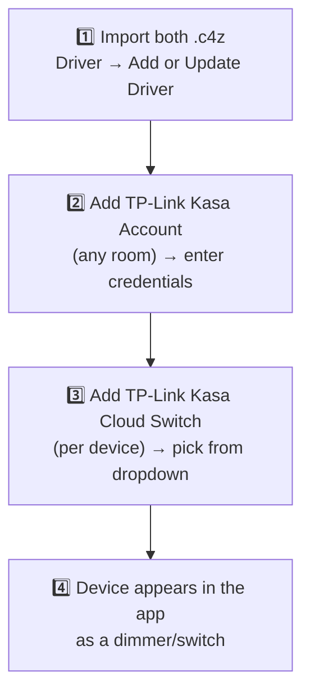

# TP-Link Kasa Cloud — Control4 DriverWorks Drivers

Control4 OS3.3+ drivers that control **TP-Link Kasa** switches and dimmers. Older Kasa devices (HS/KP/KS230) are driven through the **Kasa Cloud API**; newer **SMART** switches (KS205/KS225) — which dropped off the legacy cloud — are driven **locally over the encrypted KLAP protocol**. The system is split into two cooperating drivers so you enter your Kasa credentials **once** and every light shares them.

> **v1.1** adds native **local KLAP** control for KS205/KS225 (see §3.1), per-device cloud endpoint routing (fixes error `-20571`), and remote **Bulb**-button (`BUTTON_ACTION`) handling for Neeo/Halo remotes.

| File (source) | Packaged `.c4z` | Role |
|---|---|---|
| `account.xml` + `account.lua` | `kasa_account.c4z` | **Account driver** — holds credentials, logs in, shares the auth token + device list |
| `driver.xml` + `driver.lua` | `kasa_cloud_switch.c4z` | **Light driver** — one per physical device; drives the `light_v2` proxy |

---

## 1. Why two drivers?

A Kasa account can have dozens of devices (this project has ~28). If every light driver stored the username/password:

- You'd re-enter credentials on every device.
- Each driver would log in separately, multiplying cloud auth traffic.
- A password change means editing every driver.

Instead, **one account driver** owns the credentials and publishes a shared **token** and **device list**. Each light driver discovers the account driver **by name** and reads those shared values.



---

## 2. The Account driver (`kasa_account.c4z`)

A **combo self-proxy device** (like Control4's `generic_http` sample). It has no navigator UI — it's a background service.

### What it does
- On startup, reads **Kasa Username / Password** from its properties and calls `login`.
- Publishes the returned **token** into Control4 variable **ID 3001**.
- Fetches `getDeviceList` and publishes a compact JSON list into variable **ID 3002** (Base64-decoding the KS-series aliases and caching each device's regional `appServerUrl`, so light drivers can offer a device dropdown and reach the right cloud endpoint).
- Computes the **KLAP auth hash** `SHA256(SHA1(user)..SHA1(pass))` and publishes it (hex) into variable **ID 3003**, so light drivers can control local KLAP devices without ever seeing the plaintext password.
- Re-logs in on a timer (**Token Refresh (hrs)**, default 12h) so the token never goes stale.
- Responds to a `RELOGIN` command (sent by a light driver whose token expired) by logging in again and re-publishing the token.

### Properties
| Property | Purpose |
|---|---|
| Kasa Username / Password | TP-Link account credentials (entered once) |
| Token | Readonly — the current cached token |
| Token Refresh (hrs) | How often to re-login (1–168h) |
| Devices Cached | Readonly — number of devices found |
| Debug | Verbose logging |

### Actions
- **Login Now** — force an immediate re-login
- **Refresh Device List** — re-fetch the device list

---

## 3. The Light driver (`kasa_cloud_switch.c4z`)

One instance **per physical Kasa device**. It implements the Control4 **`light_v2`** proxy (binding `5001`), so it appears as a normal dimmer/switch in navigators and scenes.

### What it does
- On startup, finds the Account driver **by name** (`C4:GetDevices`) and registers listeners on variables 3001 (token) and 3002 (device list). Retries every 10s until the account is found.
- Populates the **Select Device From List** dropdown from the shared device list. Picking a device auto-fills **Device ID / Device Type / Is Dimmer**.
- Translates proxy commands (on/off, brightness, ramp) into Kasa cloud `passthrough` calls using the shared token.
- Polls the device on an interval and reports state back to the proxy so navigators show the correct brightness.

### Properties
| Property | Purpose |
|---|---|
| Select Device From List | Dropdown of all Kasa devices (from the Account driver) — auto-fills the fields below |
| Device ID | 40-char hex device ID (auto-filled) |
| Device Type | `IOT` (HS/KP/KS230) or `SMART` (KS205/KS225) (auto-filled) |
| Is Dimmer | `Yes`/`No` (auto-filled; auto-detected from status too) |
| Local IP (KLAP) | LAN IP of a **SMART** device for local KLAP control — see §3.1. Blank = cloud |
| Poll Interval (sec) | Status refresh cadence (10–300) |
| Status | Readonly — last known on/off + brightness |
| Debug | Verbose logging |

### Two device schemas
Kasa exposes two different command shapes. `Device Type` selects which the driver uses:

| Operation | IOT (HS/KP/KS230) | SMART (KS205/KS225) |
|---|---|---|
| On / Off | `system.set_relay_state` | `set_device_info {device_on}` |
| Brightness | `smartlife.iot.dimmer.set_brightness` | `set_device_info {brightness}` |
| Status | `system.get_sysinfo` | `get_device_info` |

> **Note:** KS230 3-way dimmers report as `IOT.SMARTPLUGSWITCH` — set them to **IOT**, not SMART.

---

## 3.1 Local KLAP control (KS205 / KS225)

Newer Kasa **SMART** switches (KS205 switch, KS225 dimmer) moved to TP-Link's encrypted **KLAP** protocol and **no longer connect to the legacy Kasa cloud**. `getDeviceList` returns them with `status=0`, and any cloud `passthrough` returns **`error_code -20571` ("Device is offline")** — regardless of token, region, or schema. This is not a bug in the account; it's a device-firmware change (confirmed: every KS205/KS225 is `status=0` while all HS-series + KS230 + KP405 are `status=1`).

To control them, the light driver speaks **KlapV2 directly to the device on your LAN** — no cloud, no external bridge:

1. Add the light driver for the KS205/KS225 as usual and pick it from the dropdown (Device Type auto-fills to `SMART`).
2. Give the device a **reserved/static LAN IP** on your router (DHCP reservation).
3. Enter that IP in the **Local IP (KLAP)** property.

The driver then handshakes with the device (using the KLAP auth hash from the account driver's variable 3003), derives an AES-128-CBC session, and sends the same on/off/brightness/status commands over the encrypted local channel. Sessions auto-recover (re-handshake) if the device reboots.



- **Routing:** a light uses local KLAP only when **Device Type = SMART *and* Local IP is set**. Everything else (and any SMART device with a blank IP) uses the cloud path unchanged.
- **Requirement:** only **KlapV2** devices are supported (KS205/KS225). The device needs a reserved IP; `getDeviceList` does not report the local IP, so it's entered manually.
- **Security:** the light driver never receives the plaintext password — only the auth hash on variable 3003.

---

## 4. How the two drivers talk

Discovery is **by name** (Control4 variables + `GetDevices`), not by a wired binding.



### Command flow inside the light driver



> **Important:** the `light_v2` proxy has **no `ON`/`OFF` command**. The navigator's on/off toggle arrives as `SET_BRIGHTNESS_TARGET 0` (off) or a `TOGGLE`. Brightness `0` is routed to a real relay-off, not `set_brightness:0` (which would leave an IOT dimmer on at minimum).
>
> **Remotes:** Neeo/Halo remotes and keypads send the **Bulb** press as `BUTTON_ACTION` (`BUTTON_ID` 0=on/1=off/2=toggle, acted on release), not `SET_BRIGHTNESS_TARGET` — the driver handles both so the remote and the app stay in sync.

---

## 5. Setup in Composer Pro

### Step 1 — Import both drivers into your library
`Driver → Add or Update Driver…` and select each file:
- `kasa_account.c4z`
- `kasa_cloud_switch.c4z`

### Step 2 — Add the Account driver (once)
1. **System Design → Search** tab → search `Kasa Account`.
2. Drag **TP-Link Kasa Account** into any room (a utility/closet room is fine — it has no UI).
3. Select it and enter **Kasa Username** and **Kasa Password**.
4. Watch its **Status** property → should read *"Logged in — token active"* and **Devices Cached** shows a count.

### Step 3 — Add a Light driver (per device)
1. **Search** tab → search `Kasa Cloud Switch`.
2. Drag **TP-Link Kasa Cloud Switch** into the room where the light lives.
3. Select it → open **Select Device From List** → pick the device (e.g. `Basement 02 (KS230(US))`).
   - This auto-fills **Device ID**, **Device Type**, and **Is Dimmer**.
4. **KS205/KS225 only:** set **Local IP (KLAP)** to that device's reserved LAN IP (see §3.1). Other models leave it blank.
5. Repeat for each physical device.

### Step 4 — Assign to rooms / navigators
Add each light to its room's lighting (Composer handles this once the `light_v2` proxy is bound). The dimmer/switch now appears in the app.



---

## 6. Troubleshooting

| Symptom | Check |
|---|---|
| Account driver not in Search | Re-import `kasa_account.c4z`, click **Clear** on Search, or restart Composer |
| Light dropdown empty | Account driver must be added and logged in first; wait ~10s or use **Refresh Device List** |
| Light shows "Waiting for Kasa Account agent" | The Account driver isn't added to the project yet |
| Commands do nothing | Enable **Debug** on both drivers; confirm the Account **Status** shows a valid token |
| Wrong on/off behavior | Ensure **Device Type** matches the hardware (KS230 = IOT, not SMART) |
| Brightness slider resets to 0 | Old issue — driver must send `LIGHT_BRIGHTNESS_CHANGED` (fixed in current build) |
| `-20571` / "Device is offline" on a KS205/KS225 | Expected — these are cloud-dead SMART devices. Set **Local IP (KLAP)** to control them locally (§3.1) |
| KLAP device unresponsive | Verify the **Local IP (KLAP)** is correct/reserved and the device is on the same subnet as the controller; enable **Debug** and check the handshake sequence |
| Remote **Bulb** button does nothing (app works) | Update to the current light driver — it handles `BUTTON_ACTION` |

Enable **Debug = On** on either driver to trace logins, HTTP calls, and proxy commands in the Control4 director log.

---

## 7. Packaging (for developers)

The driver definition XML **must be named `driver.xml` inside the `.c4z`** or Composer rejects it as "invalid file". The light driver's source is already `driver.xml`; the account driver's source is `account.xml` and must be copied to `driver.xml` when zipping.

```bash
# Light driver (source XML already named driver.xml)
rm -f kasa_cloud_switch.c4z
zip kasa_cloud_switch.c4z driver.xml driver.lua

# Account driver (account.xml → driver.xml inside the zip)
b=build_account
rm -rf "$b"; mkdir "$b"
cp account.xml "$b/driver.xml"
cp account.lua "$b/account.lua"
rm -f kasa_account.c4z
( cd "$b" && zip ../kasa_account.c4z driver.xml account.lua )
rm -rf "$b"
```

See `CLAUDE.md` for deeper implementation notes (proxy protocol quirks, variable IDs, discovery internals).
